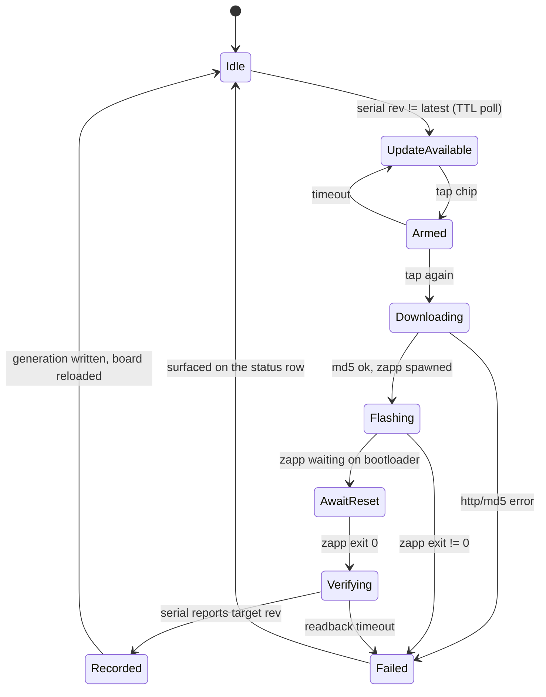

# flash + generations: zapp integration and the keymapp chop

kuiboard owns the flash loop: detect a new Oryx revision, download the firmware, drive zapp, verify the result off the board itself, and record every deployed generation. keymapp exits the picture entirely.

## locked decisions (2026-07-21)

- stock Oryx firmware with the already-mapped RESET key. no custom firmware, no zero-touch bootloader entry.
- exec the zapp binary. zapp is Rust (zapp-core + CLI), not importable from Go; exec-a-host-binary is already the house idiom (keymappdb execs sqlite3).
- generation history starts empty. no seed import from keymapp's 54 synced revisions, no binary backfill.
- keymappdb gets deleted once nothing reads it.

## verified facts

- kontrol gRPC API has no flash RPC; the Oryx raw-HID protocol has no bootloader command (zsa/qmk_modules oryx.h enum). keymapp has no flash capability the CLI path lacks.
- the board's USB serial encodes identity: `bqMJp/9DYwNW` = layoutId/revisionId, updated on re-enumeration after every flash. read via ioreg (idVendor 0x3297). this is ground truth for "deployed", not "exists in Oryx".
- `https://oryx.zsa.io/{layoutId}/{revisionId}/binary` serves the compiled firmware, and the GraphQL `revision.md5` is the md5 of that file (verified byte-for-byte against 9DYwNW). download integrity is checkable.
- Oryx GraphQL cannot enumerate revision history (no `revisions` field on Layout; introspection off). unrecorded hashes are undiscoverable later -- flash-loop capture is the only way history exists.
- no GraphQL query serves the key-code dictionary; keymapp syncs it out of band. it gets vendored.
- `oryx.FetchLayout` currently has zero callers; its signature is free to change.

## architecture

new packages under `internal/keyboard/`:

- **usbserial** -- reads the Moonlander's USB serial via `/usr/sbin/ioreg -p IOUSB -l` (exec + parse, no cgo, no new deps). returns `Identity{LayoutID, RevisionID}` or a not-present error. callers TTL-cache it; one bounded exec per interval keeps panel ticks O(1) per the constant-cost invariant.
- **keydict** -- the QMK code -> legend dictionary, vendored from the keymapp store's metadata row (one-time snapshot, trimmed to code/label/glyph), `go:embed`ed. absorbs legend.go's resolution logic (glyph runes, humanize, aliases) so keymappdb can go.
- **generations** -- append-only local store under `~/Library/Application Support/khudson/generations/`: one JSON per deployed generation (`<yyyymmddThhmmssZ>-<rev>.json`, lexical == chronological: flashedAt, layoutId, revision, prevRevision, qmkVersion, md5, the full layout payload) plus `firmware/<rev>.bin` archives. written only after serial readback confirms the flash. rollback = re-flash an archived bin; the timeline and key-diff views read the payloads.
- **flash** -- the orchestrator state machine. steps: resolve identity -> fetch target revision meta -> download + md5-verify firmware -> exec `zapp flash <bin>` (streams progress; zapp waits for the RESET tap) -> poll usbserial until the serial reports the target revision -> write the generation record + write through the oryx layout cache.

changed:

- **oryx** -- `FetchLayout(ctx, hashID, revisionID)` (explicit revision; "latest" still works and reports what it resolved to). cache stays keyed by hashID = current board snapshot.
- **board loading** -- `keyboard.FromRevision(keymappdb.Revision)` becomes `keyboard.FromLayout(*oryx.Layout, keydict.Dict)`. kuiboard and the dock load: serial identity -> oryx cache/fetch for that exact revision -> fallback to last cached layout when unplugged/offline.
- **kuiboard** -- update chip in the bar when serial revision != latest (two-tap arm/confirm; the board going DFU mid-typing is disruptive, and the tap table already treats stray taps as hostile). flash mode takes over the status row: zapp output tail, "tap RESET" prompt, serial-confirmed done.

## nix

`zapp` flake input (github:zsa/zapp), package consumed like spotatui (`inputs.zapp.packages.${system}.default`). no udev on darwin; the module route is unnecessary. kuiboard resolves the binary via PATH with the per-user profile bin as fallback (module.nix convention).

## out of scope (this cut)

- dock kb-panel update indicator + flash-from-HUD: the loader swap lands in the dock, but flash UX starts kuiboard-only.
- touchd surfacing the serial over its sockets (it already enumerates the board via hidapi); ioreg exec is self-contained and avoids touching the parked touchd/magicbus rename.
- keymapp app removal from the machine: user's call, nothing depends on it after the chop.

## validation

go build/vet via the edit hooks; goldens + unit tests through the existing nix checks (`nix flake check` / the khudson check attrs). flash flow verified live against the real board: detect, download (md5), zapp exec, RESET tap, serial readback, generation record on disk.
