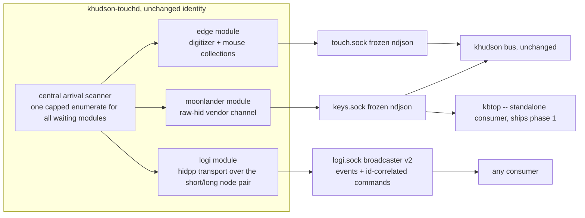

# hidbus -- a modular hid device bus (design)

status: phases 1-2 IMPLEMENTED (committed on clod-khudson-hardening, 2026-07-14: touchd module registry, central arrival scanner, -config CUE->JSON, universe.home.hidbus HM module in nix/hidbus.nix -- signingIdentity/touchdPkgs/install/plist anchors below that cite module.nix now live there). Phases 3-5 remain proposed. Original design produced by a 3-candidate design workflow (12 agents, 36 stress flaws) plus a follow-up stress pass; claims file:line-grounded against the tree as of 2026-07-14 (pre-extraction line refs).

## problem

four requirements:

1. moonlander/keyboard functionality on hosts without khudson (no Edge, HUD stack not enabled) -- without the touch surface overhead (no retry loops against an absent Edge, no touch code hot).
2. one daemon; no N hid daemons to juggle.
3. logitech is coming: HID++ is bidirectional request/response over the same handles that stream input, and a Unifying/Bolt receiver multiplexes several logical devices over one node pair.
4. the Input Monitoring TCC grant keys on binary path + signing identity (nix/module.nix:37, :273-277; install-script.nix:60-73 re-signs the same identity on every rebuild without re-prompting). grant continuity is worth real design distortion.

## recommendation: hidbus-in-place

keep the khudson-touchd binary, identity, install path, and launchd label exactly as they are -- TCC cost zero -- and modularize inside it. candidate A's skeleton with five repairs stolen from B, plus four grafts from C (below). the daemon's hardwired three-goroutine fan-in (touchd/daemon.go:69-98) becomes a module registry: edge, moonlander, logi.



## module interface

```go
type Module interface {
    Name() string
    Run(ctx context.Context, env Env) error
}
```

`Env` provides: `Publish(any)` (the module's broadcaster), `OpenShared`/`OpenExclusive(path)` wrapping openPath so the process-global exclusive-flag lock is inherited (touchd/hid.go:81-94), `RecordTap` for the edge recorder, and the load-bearing addition `AwaitDevice(ctx, Match) (path, error)`: modules never own their own backoff select. AwaitDevice is backed by ONE central arrival scanner (single hid.Enumerate per tick, reopenBackoff class semantics preserved verbatim: 30s absent / 5min seized / class-flip ramp reset, daemon.go:14-58), serialized under openMu -- which also closes the enumerate-outside-openMu race (hid.go:61-76 vs :81) and halves today's absent-Edge cost (both collectionLoops poll independently, daemon.go:82-88). when the IOKit matching-callback shim lands (phase 3) it becomes the scanner's wake channel with zero module changes.

command-capable modules add `Commander { HandleCommand(ctx, req []byte) ([]byte, error) }`.

edge and moonlander ports are code motion: collectionLoops + parseReport + mode assert/deassert (hid.go:96-158) and moonLoop + parseMoonReport + pairing-init + synthetic key-clear on loss (moonlander.go:97-158), both around the shared readLoop (daemon.go:184-206).

## transport

socket-per-topic, deliberately NOT a single multiplexed bus socket: touch.sock and keys.sock paths (khudson/internal/paths TouchSocket/KeysSocket) and their ndjson shapes are a frozen contract -- khudson bus and docks need zero changes at any phase -- and per-source eviction isolation holds by construction (a logitech notification storm can never evict a moonlander keyup; the stuck-highlight class moonlander.go:155-158 / bus/keys.go:39-41 defends against). every socket keeps the umask-0o077 bind + chmod 0600 + refuse-if-dialable pattern (broadcast.go:32-62).

new/command-capable sockets get broadcaster v2: one writer goroutine per connection draining two queues -- an evictable event queue (drop-oldest, today's broadcast.go:111-125 semantics) and a NON-evictable response queue (a reply a client awaits must never be evicted by an event burst), both under the 5s write deadline, stalled client dropped. commands are ndjson requests with a client-chosen id on the module's own socket; exactly one id-echoed reply.

grafted from C:

- retained last-value replay on connect for state-shaped lines (layer-state, battery, per-device presence) on NEW sockets only: a restarted consumer is currently wrong about layer state until the next layer event (proto KeyEvent kind "layer", moonlander.go:82) -- fire-and-hope. one retained value per line kind per device, bounded; keys.sock/touch.sock wire stays byte-identical.
- per-client in-flight command cap (~4): the non-evictable response lane is otherwise an unbounded-memory hole against a command-spamming client.

## activation and config

per-host module config authored in CUE, vetted and exported to plain JSON at nix build time (edgeCUE precedent, module.nix:121-129), read via a new `-config` flag with stdlib encoding/json -- cuelang.org/go stays out of the TCC binary (it also zeroes stdlib log flags in an init; we have scars). fail-fast: `-config` passed but unreadable = exit nonzero (a keyboard-only host must never silently reinstate a perpetual Edge poll); flag absent = legacy edge+moonlander default until the nix module passes -config everywhere.

- disabled module: literally zero -- no goroutine, no socket, no enumerate membership.
- enabled-but-absent: one shared capped scan (phase 2), then event-driven IOKit arrival (phase 3).
- config changes kickstart the agent via a separate config-hash marker -- NOT folded into the install stamp, or every config edit would force a full reinstall+re-sign (install-script.nix:60-73 only touches the marker on the reinstall branch).

## packaging

extract `universe.home.hidbus`, a sibling home-manager module owning everything touchd-scoped: the derivation (module.nix:81-93), signingIdentity + touchdPkgs options (:273-284), install activation (:415-425), agent plist/launcher (:165-206), state dirs, kickstart marker (:449-452), rendered config, and the shipped standalone consumer. khudson's module requires hidbus with edge+moonlander enabled.

INVARIANT (was implicit, now stated): the identity string `khudson-touchd` also signs khudson itself -- the Accessibility TCC client (module.nix:49-50, :383-392). it is single-sourced in hidbus, referenced by khudson, never renamed, never duplicated-divergent; the cert is never deleted while any host runs khudson. fresh keyboard-only hosts inherit the imperative precondition: the GUI keychain cert bootstrap (module.nix:261-272) must precede the first switch or activation aborts at codesign (install-script.nix:68 under set -e).

## logi module (hidpp) -- DECIDED: direct-Bluetooth first, MX Master 4, battery leads

Open-question 3 answered by a feasibility research pass (17 agents, verified). Target device: Logitech MX Master 4 for Mac over DIRECT Bluetooth (not a Bolt/Unifying receiver). This is the SMALL path and it retires most of the receiver complexity below.

2026-07-14 UPDATE: the full Options+ replacement feasibility report (93-agent prior-art pass, quorum-verified) lives in logi-replacement-design.md -- capability matrix, phase 5b (config re-assert; no onboard profiles exist on MX Masters) + 6a/6b (divert engine) extensions, transport rules against the pinned go-hid, and the expanded logi-0 spike list. Its verified corrections to THIS doc are folded in below, marked [corrected 2026-07-14].

**Gate: conditional-GO.** The access mechanism is confirmed, not speculative: Solaar PR #2730 (merged 2025-01-01, https://github.com/pwr-Solaar/Solaar/pull/2730) is a direct macOS + BLE precedent -- a userland hidapi process opens the Logitech HID++ vendor collection over direct Bluetooth (no receiver) on macOS and exchanges 0x10/0x11 reports, tested on MX Master 3S + MX Keys. [corrected 2026-07-14] Its diff REMOVES a pre-existing path-keyed usage-page-1 strip (which had been dropping the vendor collection too, since macOS BT collections shared one path) -- it does not add stripping; the conclusion (vendor collection reachable) is unchanged. What is NOT confirmed is the MX Master 4 specifically (announced 2025-09-30; three public feature dumps exist, ALL Bolt-receiver captures, none direct-BLE) -- hence conditional on a one-device probe, not a research gap. TCC is moot: khudson-touchd already holds Input Monitoring.

Direct BLE is a SINGLE vendor node, pure HID++ 2.0 -- so the receiver two-node machinery below (short/long node pair, cross-node demux, HID++ 1.0 registers, 0x41 sub-device presence) is very likely MOOT; confirm node count in the spike and, if single-node, the pending-request demux collapses to one handle.

**logi-0 spike (<1 day, replaces the ~2-day receiver spike):**
- enumerate via sstallion/go-hid; filter VID 0x046D + UsagePage 0xFF43 (expect Usage 0x0202, the BLE tuple -- NOT 0xFF00/0x0001, which is the receiver path). Disambiguate by usage_page/usage, NEVER by path. [corrected 2026-07-14] The original #127 rationale (identical IOService paths for all BT HID) was fixed in hidapi 0.11.0 (unique DevSrvsID paths; the bundled 0.15.0 has the fix) -- the rule survives for the real reason: ALL usage pairs of ONE device share one path, and OpenPath opens the whole IOHIDDevice, so only the usage tuple selects the vendor collection. The phase-2 scanner already keys Match on the VID/PID/UsagePage/Usage tuple. Never cache DevSrvsID paths across disconnects; re-enumerate on every reopen.
- open NON-EXCLUSIVE: SetOpenExclusive(false) = kIOHIDOptionsTypeNone (hidapi's macOS default after hid_init is seize, which is FORBIDDEN here). Maps to Env.OpenShared. [corrected 2026-07-14] ORDERING RULE: hid.Init() MUST run before SetOpenExclusive(false) in any fresh process -- pre-init the setter is clobbered by hid_init's exclusive=1 default (touchd already calls hid.Init() deliberately at main startup).
- [added 2026-07-14] single reader goroutine owns Read and drains CONTINUOUSLY: the per-handle hidapi queue is bounded at 32 reports with silent oldest-drop (~250ms of 125Hz motion), and mouse reports interleave with 0x11 HID++ frames on the one handle -- filter by report ID, demux replies by swId.
- probe node topology (0x10 short + 0x11 long, or 0x11 only -- do not assume).
- HID++ 2.0 root ping on 0x11, device index 0xFF (fallback 0x00), feature 0x00, distinct swId nibble + marker; success = 20-byte reply echoing marker+swId.
- contention check: rerun with Logi Options+ RUNNING (its agent + daemon must be quit to clear ownership -- it is the real contention risk) to document seize-fail vs non-exclusive coexistence.
- prove a NUMBERED SetReport works (the moonlander write is UNNUMBERED, moonlander.go:90-94 -- proves the pipe, not this framing).

**phase-1 logi capability: battery surfacing, read-only.** Feature query: root 0x0000 -> getFeature(0x1004 UNIFIED_BATTERY) to resolve its index (fallback 0x1000 BATTERY_STATUS) -> getStatus -> state-of-charge % + charging state. Poll on a bounded 60-300s interval, never per-tick (constant-cost); single direct node = one device, no receiver fan-out. Published as a retained state-shaped line on logi.sock. It sends one request and reads the reply -- module-internal, does NOT need the client-facing command lane.

**contention rule:** coexist, never seize. Always open the vendor collection non-exclusive; NEVER open the usage-page-1 keyboard/mouse collections (OS pointer input untouched). If Options+ holds the device and open fails, back off (seized class, 5min) and surface "logi unavailable (Options+ holds device)" -- never force-quit Options+. Caveat to verify in the spike: whether two non-exclusive openers (us + Options+) can both run request/response without response cross-talk -- the distinct swId nibble is the disambiguator.

**deferred to the command path (phase 4+, needs Commander + broadcaster v2):** button remap (0x1B04 V6), DPI (0x2201 -- 0x2202 absent on MX4), SmartShift (0x2111 SMART_SHIFT_ENHANCED -- 0x2110 is ABSENT on the MX4 [corrected 2026-07-14]), hi-res wheel (0x2121, MX4 quirk: verify before promising smooth scroll), thumbwheel (0x2150), haptics (0x19B0), force-sense threshold (0x19C0 FORCE_SENSING_BUTTON), host switch (0x1814) -- all MUTATE device config. [corrected 2026-07-14] There is NO onboard-profile persistence on any MX Master (0x8100 and 0x1C00 absent from every dump): host-side re-assert (phase 5b in logi-replacement-design.md) is the ONLY persistence mechanism -- desired state replayed on every device (re)open and on 0x1D4B reconfNeeded.

**app-only, do NOT design for** [corrected 2026-07-14, per the verified capability matrix]: Logi Flow (LAN protocol; the device half 0x1814 fits phase 4 as manual host-switch), AI Prompt Builder / cloud sync, firmware DFU (fallback: temporary Options+ install per update). RECLASSIFIED host-reimplementable (consumers over logi.sock, zero touchd change): per-app profile switching (NSWorkspace frontmost watcher, khudson-side), Smart Actions / macros (divert CID -> Go action), Actions Ring (our own overlay on diverted CID 0x01A0 + 0x19B0 haptic tick; the Options+ ring UI itself is app-rendered, no wire protocol).

**receiver path (deferred, only if a Bolt-paired device ever matters):** owns a transport spanning the short(0x10)/long(0x11) NODE PAIR; the pending-request demux domain must span the handle pair (a per-handle demux silently drops every cross-node reply); sub-device presence is WIRE VOCABULARY from 0x41 connection notifications, not an enumerate fact (the arrival scanner sees only the receiver node); config-writes use dirty-flag commit batching (ratbagd). Not needed for the MX4 direct-BT cut.

## phases (each independently deployable)

1. **module registry + hidbus HM module + kbtop.** requirement 1 lands whole: a khudson-less host runs the daemon with only the moonlander module, and a NAMED consumer ships with it -- kbtop, a terminal moonlander viewer reusing khudson/internal/keyboard (board/geometry/matrix + keymappdb/oryx) with a keys.sock dial loop patterned on bus/keys.go:25-44 plus a --raw ndjson tail. a bound socket with zero subscribers is packaging theater (the fatal that killed both other candidates as-written). Edge hosts behaviorally unchanged.
2. **central arrival scanner.** absent-device cost drops to one capped scan for all waiting modules; enumerate race closed. daemon-internal only.
3. **IOKit matching-callback shim (cgo) -- OPTIONAL, deferred.** phase 2 already gets steady-state absent cost to ~0: a bound-but-idle socket is free, and the central scanner is ONE cheap `hid.Enumerate` per 30s shared across all absent modules. So this phase does NOT buy steady-state cost -- it buys REATTACH LATENCY (instant device-arrival vs up-to-30s on the capped poll). Ship it only if up-to-30s to notice a re-dock / re-pair is unacceptable. Keeping it optional removes the design's one unverified feasibility item (a second IOHIDManager coexisting with go-hid's) from the critical path.
4. **broadcaster v2 + Commander.** dual-queue writer, id-correlated requests, retained lines, in-flight cap. also the seam for a moonlander command surface later (oryx protocol: layer set/lock, RGB) with no further transport work.
5. **logi module.** DECIDED direct-BT MX Master 4, battery-first (read-only, phase-1 logi capability above) behind the <1-day logi-0 spike; button/DPI/gesture config deferred to the command path. events on logi.sock. Bolt/receiver path deferred entirely.

## rejected

- **A as written** (grow touchd, consumers frozen): FATAL -- names no consumer for the keyboard-only host; keys.sock's complete consumer chain today is bus keyLoop -> dock kb widget, absent by definition there. typing works without the daemon; the vendor channel is a visualization/command feed (moonlander.go:1-9). shipping it would be a TCC-granted daemon fanning events to nobody.
- **B (hidbusd re-platform)**: same fatal (its only designed client is the khudson-side busclient), plus a re-prompt + new cert bootstrap + protocol + migration choreography that buys events nobody consumes. its good mechanisms (arrival env, demux, dual-queue, committed cgo spike) are stolen above.
- **C (feature bus)**: stressed separately after the first review truncated it. same standalone-consumer fatal (its own claims concede the thin client is "enabled, not shipped"); logitech lenses found the cross-node reply hazard unhandled and replies evictable; migration forces the proven gesture hot path through a brand-new single-socket read side. its four good mechanisms are grafted above; the feature taxonomy itself buys nothing once logi.sock carries per-device ids -- receiver multiplexing is 6 id values, and cross-topic aggregation is a topology fact not worth the taxonomy seam churn.

## what gets worse

- the TCC binary stops being small-and-rarely-rebuilt: logi + demux + config + broadcaster v2 land in the granted binary; feature work means routine re-sign + kickstart, each blipping the streams (the pinned touchdPkgs input still shields it from nixpkgs churn).
- broadcaster complexity on the hottest path: 141 LOC write-only fanout -> bidirectional dual-queue per-connection writer.
- naming debt is permanent unless a re-grant is paid: keyboard-only hosts run `khudson-touchd` under `Application Support/khudson` with an `org.khudson.touchd` label.
- fresh-host onboarding stays imperative and two-step (cert bootstrap, then a first-run Input Monitoring prompt that, if dismissed, leaves a denied row KeepAlive happily relaunches into).
- absent-device steady-state cost is ~0 (idle socket is free; the central scanner is one cheap enumerate/30s) -- NOT worth sweating. The only residual without the optional phase 3 is reattach LATENCY: up to 30s to notice a re-dock/re-pair.
- socket paths stay hand-mirrored across the module boundary (touchd/main.go:146-152 vs khudson/internal/paths), pinned by tests only.
- record/replay stays edge-only (recording.go taps the edge emit); per-module capture is named debt.

## open questions (yours)

1. naming: live with khudson-touchd/org.khudson.touchd on keyboard-only hosts forever, or pay one Input Monitoring prompt per machine to rebrand? (either way the khudson-touchd cert survives -- it signs the Accessibility client too.)
2. is one TCC re-grant per machine acceptable at all? the design assumes no; a yes reopens the rename and parts of B's identity split.
3. RESOLVED: direct-Bluetooth first (MX Master 4), battery leads. See the logi section.
4. phase-1 standalone consumer: kbtop the live TUI, a plain ndjson tail CLI, or a command surface (layer set / RGB via oryx protocol, which pulls phase 4 earlier)? one must ship in phase 1; pick, and name it.
