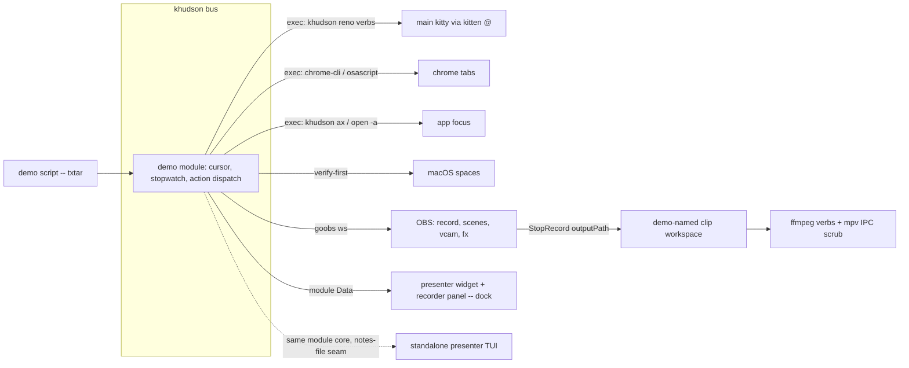

# reno -- khudson demo presenter / recorder (design)

status: proposed. Produced by a 94-agent prior-art run (28 claims 3-skeptic quorum-verified; codex leg down) and a 81-agent design review (codex up; the first cut failed on two fatals, all 16 confirmed findings are folded in below; 38 low-tier findings sat over the verify cap and remain unverified -- re-review before implementation). Annotation rounds 1-2 folded 2026-07-22: script format flipped CUE -> txtar/testscript; presenter/recorder became dedicated layouts behind one strip tab; OBS accepted as sole capture engine; component named reno end to end; moviemaker ships both surfaces over one core. No open user gates remain -- the four verify-first spikes are the remaining gates. [V] = quorum-verified, [U] = cited-unverified; load-bearing [U] items appear in the verify-first gates. The demo-presenter-recorder-register memory (2026-07-22) is the authoritative requirement set; this doc must not silently narrow it. Companions: standalone-modules-design.md (couch doctrine), magicbus-design.md (daemon fabric), overlay-subsystem-design.md (dock modal vocabulary).

## the two use cases, one spine

- live presenter: speaker notes per step, scripted machine transitions (focus kitty session a -> chrome slides tab -> kitty session b, space switches), elapsed + per-step timers with over-limit color.
- recorder: everything above optionally, plus an OBS transport panel (record/scenes/virtual cam/webcam FX), multi-display capture, and ffmpeg post (trim/stitch/audio) over demo-named clip workspaces.

The spine is the demo script file: one file per demo -- name, steps, recording config; a run yields a tracked demo name that keys the clip workspace. No surveyed format (demo-magic, doitlive, presenterm, asciicast, VHS tape, adv-ss macros) co-locates {note, budget, actions} per step, and none has per-step targets or time budgets [V] -- the format is specified from scratch as a txtar archive with testscript-style step commands (see the format section), not a pdfpc-style spec-less sidecar [U].

## decomposition (standalone-modules doctrine: composable core, thin clients)

## the engine is a native module

Native (not exec/scrape); cross-poll state for the step cursor is legal [V]. P0 is not module-only work: it also carries bus protocol changes (effect transitions, run lifecycle, subprocess ownership) and dock rendering (wrapping, heat, paging) -- the two normative sections and the widget section below.

- essential: load shedding exempts only native polls marked essential; exec scrapes always shed [V]. Demos run exactly when the machine is loaded, so the module implements Essential().
- 1s poll floor (250ms scheduler tick) [V]: budget color flips at 1Hz suffice; sub-second animation is dock-side render state.
- the component is **reno**, end to end (user, 2026-07-22): module + schema name, the strip tab, the CLI verb family (`khudson reno ...`), the script (a reno script). One registry entry + #Module vocabulary extension [V]; `demo-mode` (the unrelated renderer showcase) keeps its name.
- rejected alternative: dialing khudson.sock as a peer over TypeForward/TypeAction (protocol-declared and bus-handled, but no live producer today [V]) buys nothing until a couch client needs it.

## effectful act transitions (normative)

One tap on "next" must move the cursor (in-process) and fire that step's machine actions (exec). The shipped contract cannot express that: `HandleAct(argv) bool` is handled/not, and the bus either repolls-and-returns or execs the original argv, never both (module.go:127-135, input.go:66-72). So:

- a second, optional module interface returns `{handled bool, effects [][]string}`; plain ActHandler modules are untouched.
- a bus-owned effect executor pushes each effect argv through the existing vetted startArgv path (allowlist, reaping) -- a new dispatch site, not a new exec mechanism.
- effects run under process-group tracking with cancel-on-shutdown. Today's row-act children are exec.Command with only a reap goroutine and shutdown never terminates them; a hung demo wrapper surviving a restart would mutate kitty/OBS/filesystem against the next run.
- debounce re-keying: consecutive steps legitimately repeat identical argvs (same focus target, same scene), and the 2s identical-(widget,argv) debounce would silently eat them on stage. Effects key the debounce by run id + step ordinal; the raw-argv guard stays for plain row acts.
- why exec at all, rather than module-internal calls: the tap itself is in-process (dock -> bus -> module transition); only the machine action runs as a subprocess. That buys hang isolation (a wedged kitten @ or osascript cannot stall the bus input worker, and process-group cancel has something to kill), per-verb TCC identity routing (different argv[0]s), a process boundary for the confirmation events to journal, and the same verbs stay drivable from a shell or a couch client with no dock running.

Costs: the module contract stops being effect-free; the bus input worker owns effect ordering and child lifecycles; shutdown slows and needs partial-action cleanup.

## demo run lifecycle (normative)

Native modules get only static widget params, reload rereads the fixed bus ConfigPath, and #Action extension covers none of this -- script loading needs its own path:

- `khudson reno load <script> | start | stop | status` -> bus ctl -> module control seam. load vets the script (txtar parse + command registry, loud errors) and stages it; start stamps a run id; stop finalizes the run journal.
- run journal in the state root: script path + hash, run id, cursor, per-step actuals, recording state. Reload keeps module instances, so a script-hash check resets the cursor when the script changed (demo A's cursor must not leak into demo B); a bus restart mid-run recovers cursor and recording state (a crash must not lose "OBS is still recording").
- one run at a time; load-while-running requires stop or an explicit --replace; staging is atomic (vet fully before swapping).

Costs: a new public control surface and persistent run state on the bus.

## action dispatchers

**kitty (P0).** kitty-sessions does not use the raw rc.Client; it execs `kitten @ --to unix:main-kitty.sock ls` [V]. The three-socket firewall stands: rc.Client is substrate-only, main-kitty.sock is reachable only via exec'd kitten @ with a sanctioned verb surface of exactly ls / focus-window / launch, and text/key injection is refused at config-vet and runtime [V]. Demo steps ship as a CLI wrapper (`khudson reno focus-session <handle>`, ...) with the claudeverb confirmation discipline: fresh ls before every act (never trust poll-time ids), resolution rooted in user vars planted at `launch --var` (survives shell title rewrites [V]), revalidate-at-exec. That is the kitty-sessions seam today; extending rc.Client to dial main-kitty is a separate decision this design does not take. Focus steps must not set no_response (a zero-match still exits success with it) [V]; `launch --keep-focus` pre-stages windows without stealing focus [U]. All kitty claims pin to v0.47.4; no flake check guards drift [V].

- confirmation events: the claudeverb log cannot back wait guards as-is -- writes fail silently, ls runs only before the act, "ok" records kitten exit status with no post-action read, and lines carry no run/step ids, so stale runs would satisfy naive waits. Demo verbs emit correlated structured events (run id + step ordinal + action index) with a post-action ls, and fail loudly on journal-write failure. Costs I/O and latency per step.
- TCC identity: claude rows publish bare `khudson`, safe only because those verbs are socket-driven kitten @ with no TCC surface. AX-touching verbs must publish os.Executable() argv[0] (the dockmirror pattern) so the child runs under the granted fixed-path identity. kitty/OBS verbs may resolve via PATH; app-focus/AX verbs must not.
- handle uniqueness: FindWindowByUserVar returns the first match and launch enforces no var uniqueness, so a failed re-stage makes a handle ambiguous. Resolution rejects duplicate handles with a loud error naming both windows.
- no state overlap with dockmirror: it mirrors macOS apps (lsappinfo/AX), not kitty windows. The kitty-window peers are kittysessions (display-only rows) and this resolver, and they deliberately share nothing at poll time -- resolution is a fresh ls at exec.

**app focus (P0).** `open -a` / NSRunningApplication appear in no TCC service list [U]; Sonoma made activation cooperative (a background HUD activating third apps can get refusals and bouncing Dock icons), so pair activate with an AX raise under the existing Accessibility grant. The existing `khudson ax` code is not general app focus -- the only raise in the tree is the unminimize fallback (exact-title, minimized-only, Space-blind: kAXWindows omits other-Space windows). A demo `ax focus` verb is a new AX subsystem: bundle-id resolution, window selection policy, post-condition verification, and a stated interaction with the deferred Spaces decision. Budget it as new work, not reuse.

**chrome tabs (P2).** CDP is reportedly dead on the daily profile since Chrome 136 (remote-debugging-port ignored without a custom user-data-dir) [U, gate 3]. Path of record: chrome-cli (`activate -t <win>:<tab>`, stable ids, Scripting Bridge over the same sdef) or direct AppleScript `set active tab index` [U]; either needs one Automation (AppleEvents) pair-grant, and the grant lands on the responsible process -- exec'ing osascript from under kitty attributes the grant to kitty; disclaim responsibility or route through the khudson binary [U]. Hammerspoon was considered and rejected here too: a resident Lua daemon holding its own Automation/AX grants, for capability chrome-cli/osascript already provide (and its spaces module already fell as experimental).

**macOS spaces (P2, verify-first).** kitty never switches Spaces itself; cross-space focus behavior hangs on the AppleSpacesSwitchOnActivate Mission Control default [U]. Deterministic options, in preference order: (a) reframe to AeroSpace-style "make the right windows visible" -- no SIP, no private-API churn [U], the leaning (endorsed in the 2026-07-22 annotation round); (b) yabai `space --focus`, whose SIP-free claim as of v7.1.19 is single-source [U, gate 4]; (c) synthesized ctrl-arrow via CGEvent under PostEvent TCC [U]. Hammerspoon hs.spaces is explicitly experimental with visible Mission Control flashes -- rejected for a timed demo [U]. Decision lands with an on-machine spike at P2; P0 ships without space switching.

**OBS (P1+).** One goobs connection (the only maintained v5 Go client; pin it -- conformance-tracked to obs-websocket 5.7.4) [U]. Capability-probe at connect via GetVersion.availableRequests rather than assuming doc parity [U]. Record lifecycle: StartRecord/StopRecord/ToggleRecordPause; StopRecord returns outputPath -- the synchronous handoff into post, no filesystem watching [U]. GetRecordStatus feeds the HUD recording timer. One ScreenCaptureKit source binds one display, so multi-display demos are scene-per-display switched via SetCurrentProgramScene; UUID addressing makes scripts rename-proof (filters stay name-addressed) [U]. Prefer display/application capture over window capture (SCK window quirk history) [U].

**webcam FX (P3).** Instant move/scale-huge: stock SetSceneItemTransform; visibility: SetSceneItemEnabled -- no plugin [U]. Eased motion (the bounce): pre-authored exeldro Move filters fired remotely via SetSourceFilterEnabled [U]; pixelate via composite-blur, parameters ordinary filter settings [U]. Fully dynamic paths: SerialFrame RequestBatch with Sleep pseudo-requests, frame-locked in OBS [U]. Advanced Scene Switcher's vendor API would move demo logic into OBS's scene-collection store, where it is stripped if the plugin is absent -- rejected; the script file stays authoritative and OBS is an actuator only [U]. Both plugins move fast: nix pins plus the connect-time probe.

**gmeet (P3, gates 1-2).** OBS virtual cam is a CMIO camera extension (OBS 30+/macOS 13+) with a one-time system-extension approval that MDM can block outright [U, gate 1]. Meet has no camera allowlist (the DAL-era reports are stale), but a normal camera tile's quality ceiling makes terminal text illegible; the target is Meet's "present content from camera" (2025), which takes a camera device as the presentation tile at up to 1080p30 and is Workspace-edition-gated [U, gate 2]. Zero-approval fallback that always works: render the composed scene in a browser page and present-a-tab [U]. Operational pins: OBS output 1920x1080 NV12 (I420+Full range renders black downstream), start the virtual cam before joining, disable macOS Reactions per-app for the virtual cam (default-on; a hand gesture fires fireworks over the demo) [U].

**post (P4).** Clips from one OBS profile are homogeneous, so the concat demuxer stays lossless; the ffconcat list's per-file duration/inpoint/outpoint expresses trim+stitch of N takes in one invocation, with the standard keyframe caveat (copy snaps to keyframes; re-encode per clip for exact cuts -- LosslessCut's smart-cut is unreliable, don't build on it) [U]. Audio drop/replace (`-an`, `-map 0:v -map 1:a -c:v copy`) is pure remux [U]. Scrub/review: mpv JSON IPC over a unix socket (ndjson seek/frame-step/time-pos, no cgo) [U]; LosslessCut stays the manual escape hatch. CLI verbs first (`khudson reno trim|stitch|mute ...`); then the moviemaker core grows BOTH surfaces -- a touch view behind the reno tab and a main-display app -- as thin clients of one core, the standalone-modules shape (annotation round 2: "why not both? should just be a matter of layout and code structure" -- it is, given the core/client split).

## demo script format (txtar + testscript-style commands)

Decision (annotation round, 2026-07-22): a txtar archive per demo. The comment section carries the step script as testscript-style command lines; file sections carry the speaker notes as real markdown, with external file references allowed for shared material. This supersedes the first cut's CUE lean on the axis that matters most -- notes are the bulk of a script and author as plain markdown instead of multiline strings -- and the command shape maps 1:1 onto the engine's dispatcher registry (the go-internal testscript pattern: features wired as registered commands). We reuse the format and the registry pattern, not the test runner: the engine implements its own stepper over the parsed archive. What CUE would have bought and this gives up: a declarative constraint language and vet symmetry with edge.cue; the replacement is `khudson reno vet` -- parse the archive, resolve note refs, check every command against the registry (unknown command or arity = loud error), pin the name slug and workspace containment. A nix check vets committed scripts; ad-hoc scripts vet at load. Syntax below is illustrative; it settles in the P0 spec.

Step shape: a `step` directive opens a step; `note <file.md>` binds its notes; `budget 90s` its time budget; the remaining lines are commands. Semantics taken from the survey [V]:

- wait guards (VHS `Wait +Screen /regex/`): a readiness condition gating advance instead of fixed sleeps, expressed against the demo verbs' confirmation events -- not substrate scraping.
- capture gates (VHS Hide/Show): per-step off-camera flag driving OBS record-pause/resume.
- markers as steps (asciicast `m` + label): human-gated advance over a linear timeline is the base interaction; touch next/prev is the pause-on-markers pattern.
- note fragments per action (Slidev [click]): a step's note file may carry fragment markers that segment against its commands.
- commands are engine-registered (focus-session, chrome-tab, space, obs-scene, obs-record, obs-fx, wait, ...): the vocabulary is closed by construction, and the global #Action schema is untouched -- the demo tool owns its script surface end to end (parsing, registry, its own UI), per the annotation that this is tool-internal detail, not a config-vocabulary change.
- archive header: `demo <name>` plus optional total budget and recording config (scenes, targets, vcam, workspace).
- workspace identity (enforced by vet from P0 even though recording is P1): the name is regex-pinned like widget ids (`^[a-z][a-z0-9-]*$`), each run writes to `<workspace-root>/<name>/<run-id>/` so retakes never mix, and containment is vetted (no absolute or traversal escapes from a script file).

## timers

One engine-owned stopwatch, N read-outs: bubbles timer stops dead at zero and cannot render overtime; stopwatch plus per-step diffs at boundaries is the shape, and it is O(1)-tick [U]. Display: stagetimer-style green/yellow/red thresholds on the per-step budget, pdfpc-style negative counting in loud red past zero [U]. Per-step budgets and cumulative pace together in a terminal has no prior art -- ship per-step first, add reveal.js-style whole-talk pacing later if wanted. A rehearse/calibration mode (record actual step durations to seed budgets) is a later maybe. Colors are data (heat vocabulary); 1Hz flips fit the poll floor.

## presenter widget + recorder panel (dock)

- presenter: current step title + note body, next-step preview, elapsed + step chips, big tap targets for next/prev (tap-only-safe: no holds, no chords, no drags [V]), long-press overlay menu for goto/abort/record toggles.
- notes rendering: rows render one line each and Poll never learns region dimensions, so prose notes need a wrapping path. Decision: a dock-side chrome renderer for the presenter region (the resources-card precedent) wraps note text to the region rect; the module publishes text, the dock owns geometry. Rendering becomes size-dependent -- goldens per width bucket.
- timer heat: the row style vocabulary is exactly dim/accent/warn/highlight; green/yellow/red exists only in gauges/sparks. Timer chips ship as a semantic budget-fraction field (PctHeat-style) rendered through the existing heat ramp by the chrome renderer -- never raw colors from the module.
- goto paging: popovers keep only rows that fit and discard the rest (under ~22 reachable steps on this glass), so the goto menu renders windowed around the cursor with paging taps, not the full script.
- placement (annotation round, 2026-07-22): presenter and recorder are two dedicated layouts behind ONE strip tab, "reno", flipping between the views at the tab -- the strip-flip precedent -- not home-region tenants. Region geometry is peeled from the static config list before data renders, so this also answers "shown only when the script declares recording" structurally: the recorder view simply is not offered for a script without recording config. The home layout is untouched.
- recorder view: transport state from GetRecordStatus/events, scene picker, vcam toggle, FX one-shots, last-clip verbs.
- couch: the module core is dock-agnostic; the simplest cross-process notes seam is patat's notes-file-as-bus (rewrite a notes file per step; any client watches it) [U], with presenterm's UDP publish/listen as the richer two-process pattern [U]. Scheduling rides standalone-modules, not this doc.

## P1 preconditions (recorded now, land with their phase)

- module lifecycle hooks: modules are Name+Poll only and shutdown waits scheduler+caffeinate only, so a persistent goobs connection either dies every poll or leaks across shutdown/reload. P1 adds optional Start/Close hooks to the module contract before the OBS client lands.
- stale-on-error vs record controls: failed polls keep the previous act allowlist and native data carries no timestamp -- after an OBS disconnect, stale record/scene acts stay authorized and look healthy. The demo surface gets explicit disabled/stale states (scoped; global stale semantics unchanged).

## what gets worse

- a new always-on surface on the existing bus (module + ctl verbs + reno CLI wrapper) that must idle at zero cost.
- OBS, Move, and composite-blur ride nix inputs/overlays (pin churn accepted, per annotation); the residual risk nix does not own is the virtual-cam CMIO extension's macOS-upgrade breakage history plus the system-extension approval state [U] -- test before any live demo.
- effectful commands now execute from script files. They stay demo-tool-internal (engine registry, no global #Action change), so the growth is contained to the demo module's own surface; the one global seam is the effect executor pushing vetted argvs through startArgv.
- one more strip tab and two new layouts to maintain; the home layout budget is untouched (the rail-width claw-back stays banked).
- the kitty 0.47.4 pin becomes load-bearing for demo verbs too; still no drift check (existing debt, weight increases).

## verify-first gates (before their phases)

1. MDM camera-extension approval on aw-chainguard (gates P3 vcam entirely) [U].
2. Meet "present content from camera" availability on the actual Workspace domain (gates the P3 target; present-a-tab is the fallback either way) [U].
3. CDP-on-daily-profile death on the installed Chrome version (decides the P2 chrome dispatcher) [U].
4. yabai `space --focus` SIP-free claim on-machine (decides P2 spaces vs the AeroSpace-style reframe) [U].

## phasing (each deployable alone)

1. P0 script + presenter: txtar format + `khudson reno vet` (command registry, name slug, workspace containment), effectful-transition protocol + effect executor (per-transition debounce keys, process-group ownership), run lifecycle (load/start/stop + journal), reno CLI wrapper with kitty focus/launch (structured confirmation events) + the new ax focus verb + open-url, the reno strip tab with the presenter layout (wrapped notes, heat-ramped timer chips, windowed goto). Rehearsable live demos end-to-end, no OBS. The largest phase: bus protocol and dock rendering work, not just a module.
2. P1 OBS transport: goobs client behind module Start/Close hooks, record start/stop + scene switch as step actions and panel verbs, recording config in the script, StopRecord outputPath -> demo-named clip dirs.
3. P2 chrome + spaces: dispatchers per gates 3-4.
4. P3 gmeet + webcam FX: vcam per gates 1-2, Move/pixelate one-shots, SerialFrame dynamics.
5. P4 post: ffconcat/remux verbs, mpv-IPC scrub surface; moviemaker surfaces (reno-tab touch view + main-display app over one core) last.
6. couch client: standalone presenter TUI over the module core (notes-file seam first).

## open questions

None. All four original user gates resolved in the 2026-07-22 annotation rounds: component name = reno end to end; script format = txtar/testscript; OBS as sole capture engine, no ScreenCaptureKit/avfoundation fallback in P1 (from the round-1 thumbs-up); moviemaker home = both surfaces (reno-tab touch view + main-display app) as thin clients of one core. Remaining gates are the four verify-first spikes above.
