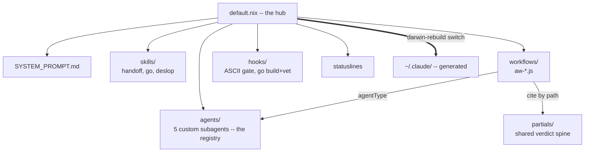
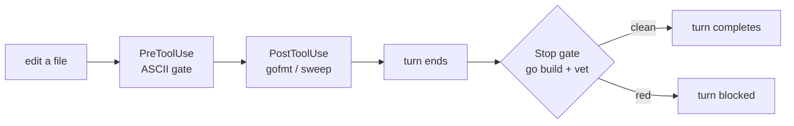

# clod

my Claude Code setup, in Nix. "clod" is the agent it builds.

it's all source. `~/.claude/` is generated -- edit it and the next `darwin-rebuild switch` overwrites your change. edit here, switch, done.

the whole thing wires up from `default.nix`, so start there.

## The hub: `default.nix`

`default.nix` is the only file that connects to the outside. Every other file in this directory is inert until `default.nix` references it. It hands home-manager a single `programs.claude-code` block, and that block is the map of the entire setup. If you want to understand any single feature, find its line in `default.nix` and follow it to the file. That is the whole design: one declarative hub, leaf files do one thing.

## Layout

```
clod/
  default.nix            the hub -- wires everything below into programs.claude-code
  SYSTEM_PROMPT.md       always-on operating rules (voice, honesty, environment)
  agents/                5 custom subagents (researcher, skeptic, reviewer, designer, mapper)
  skills/                auto-loading capabilities (handoff, go, deslop, codex-consult)
  workflows/             saved multi-agent workflows + the doctrine that governs them
    aw-*.js              the workflow scripts (research, review, audit, design-review, ...)
    partials/*.md        shared verdict spines, cited by path from a workflow stage
    CLAUDE.md            authoring rules for writing new workflows (not deployed)
    default.nix          deploys the *.js and partials to ~/.claude/workflows/
  hooks/                 guardrails, nix-pinned so they never depend on PATH
    glod/                one Go module -> two binaries (style guard, go build/vet gate)
    go-fmt-hook.sh       gofmt + goimports per Go edit
    go-build-sweep.sh    sweep stray go-build binaries out of the tree
    default.nix          builds the hook programs, imported by ../default.nix
  statusline.sh          the main dashboard (spend, model, context, branch, live work)
  subagent-statusline.sh per-agent rows shown during a fan-out
  keybindings.json       a couple of scroll rebinds
```

## The pieces, and why they earn their place

### System prompt -- `SYSTEM_PROMPT.md`

The always-on operating contract (voice, honesty, environment, GitHub). Kept short on purpose -- machine-specific detail lives in skills that load only when relevant. See [`SYSTEM_PROMPT.md`](SYSTEM_PROMPT.md).

### Custom subagents -- `agents/`

Five narrow specialists, each a few lines, each with a *stance* baked in:

- **researcher** -- one angle of a research fan-out; primary sources, falsifiable claims, a URL per claim.
- **skeptic** -- an adversarial verifier whose default verdict is REFUTED until it can independently confirm.
- **reviewer** -- reviews one assigned dimension (correctness / perf / security / test-gap), concrete findings at file:line, no style nits.
- **designer** -- proposes or stress-tests a design from one lens; one recommendation, names what gets worse.
- **mapper** -- read-only map of one subsystem slice, relative to a stated goal.

Why custom instead of the stock generalist agent: a generalist hedges. A skeptic that *defaults to refuted* and a reviewer that *stays in one lane* produce sharper, more honest fan-out -- and they make the workflows below trivial to compose, because each stage just names the specialist it wants. This set is the **registry**, and the registry is frozen at session start: a new agent file is only picked up by a fresh session.

### Workflows -- `workflows/` (the heart of it)

A workflow is a JavaScript script that orchestrates many subagents deterministically: fan out, verify, synthesize. `workflows/default.nix` auto-deploys every `*.js` (and every `partials/*.md`) to `~/.claude/workflows/`, so dropping a new file in is the only step.

The `aw-*` suite covers the recurring shapes:

| Workflow           | Shape                                                                               |
|--------------------|-------------------------------------------------------------------------------------|
| `aw-research`      | multi-modal search -> refute-verify -> synthesize                                   |
| `aw-prior-art`     | deep-dive prior-art sources -> verify load-bearing claims -> cited report           |
| `aw-review`        | scope a diff -> review per lens -> refute-verify each finding -> one ranked verdict |
| `aw-audit`         | map packages -> audit per lens -> verify -> p0/p1/p2 fix list                       |
| `aw-design-review` | frame + lock constraints -> critique per lens -> verify -> one recommendation       |
| `aw-implement`     | lock a spec -> execute in a spec-only subagent -> verify vs acceptance -> review diff |

**What this buys you over just asking the model to "review the diff":** explicit, encoded control over the things that make multi-agent work trustworthy instead of theater.

- **Fan-out width and which specialist runs each stage** -- a stage names `agentType: REVIEWER` or `SKEPTIC`, resolved from the registry above. `subagents=stock` swaps them for the default workflow agent in one flag.
- **Real adversarial verification** -- every load-bearing finding is judged by N independent skeptics (`votes=3`) with an explicit quorum, and refute-by-default lives in the schema, not just the prompt. A single hallucinated verdict can't carry a finding.
- **One intensity knob** -- `intensity=0..10` scales fan-out / votes / passes together, but only the knobs you didn't set by hand.
- **Honest accounting** -- findings are deduped before verification; caps are loud (`verified 7/15, 8 over cap`), not silent truncation; failed verifiers are counted, not swallowed; sub-quorum results are tagged UNVERIFIED and kept out of the confirmed set.
- **One reconciled verdict** -- the run ends in a single go/no-go or one ordered fix list, never a pile of per-agent JSON for you to collate.

Two `partials/` (`SYNTHESIS.md`, `DESIGN_DOCTRINE.md`) hold the shared "how to write a verdict" discipline -- confirmed-only, name the trade-off, no option buffet. The synthesis stage cites them by their deployed path instead of restating them, so every workflow's verdict obeys the same spine without copy-paste. `workflows/CLAUDE.md` is the authoring guide: the anti-patterns (silent caps, swallowed failures, hardcoded scope, single-vote theater) that make a *broken* run look like a *clean* one.

### Hooks -- `hooks/` (the guardrails)

Hooks are the part that makes the honesty rules enforced rather than aspirational. All four are nix-pinned (built with `writeShellApplication` / `buildGoModule`), so they carry their own tools and never depend on `PATH`.

- **fancypants** (PreToolUse on Write/Edit/MultiEdit/Bash) -- blocks decorative Unicode and banner/divider comments (`// ---- foo ----`, `# ====`) in files, plus decorative Unicode in git-commit / `gh` pr/issue/release prose. Keeps em-dashes, smart quotes, and ASCII-art section headers out of the things that ship.
- **go-fmt-hook** (PostToolUse on Go edits) -- `gofmt -e` syntax-gates the file; on clean syntax `goimports -w` reformats in place. Queues the file for the Stop pass.
- **go-build-sweep** (PostToolUse on Bash) -- sweeps stray `go build` binaries into a gitignored `.claude/bin/` so they can't be committed.
- **gocheck** (Stop) -- `go build` + `go vet` the edited packages and *blocks the turn* on a failure. This is the teeth behind "verification is a gate": a claim of "it builds" has to survive the compiler before the turn can end.

`glod/` is a single Go module that compiles to two of those binaries (`fancypants`, `gocheck`) and runs its own txtar test suites at Nix build time.

### Statuslines -- `statusline.sh`, `subagent-statusline.sh`

The main statusline is a flat, multiline dashboard that grows with activity: model nickname (`opus` renders as `opie`, `fable` as `fabio`), effort, context gauge, branch, worktree, PR state, and a **spend tape** -- session / today odometer, burn rate, and a heat sparkline. Spend is measured in **raw tokens**, not estimated dollars: simpler, exact, and immune to the per-model price drift a hardcoded rate table would carry. It renders instantly from a cache and refreshes the scan in the background.

`subagent-statusline.sh` is the live companion: one row per subagent during a fan-out (status glyph, type, token count, a braille velocity tape, elapsed), hiding agents that are queued but haven't started yet.

### Skills -- `skills/`

Skills are capability docs the model loads on its own when their description matches the work. Wired: **handoff** (continuity notes that survive compaction), **go** (the Go hook contract, so the agent works *with* the hooks above instead of fighting them), **deslop** (a final scrub pass for AI-tell residue). **codex-consult** (a cross-vendor second opinion) is present but intentionally not wired -- it needs codex configured first.

### Keybindings

`keybindings.json` rebinds scroll-to-bottom.

## How it fits together

`default.nix` wires every piece; the workflows lean on the agents and the partials.



The guardrails fire on their own as you work -- edits get gated, and the turn won't end on a broken build:


